# Room Designer 3D

An Android interior-design game built with [Godot](https://godotengine.org) 4.5.

You start with $3,000 and one quarter of a city out of six. Pick a house off the map, read what the
owner wants, go and buy the furniture into your own stock, then fit the room out from that
stock until every line of the brief is ticked and hand it over for the fee. Finished jobs
pay experience, and levelling up opens the pricier shops, the better paints and the larger
houses. Then you buy the next quarter of the city, and the one after that. It is House
Flipper's loop, shrunk to a phone screen.

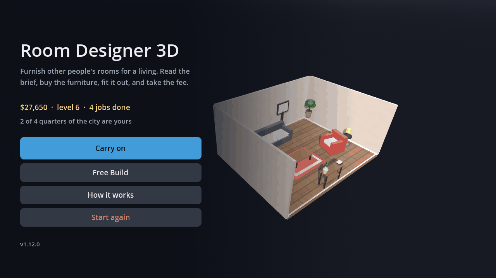

The app opens on a front page rather than dropping you onto the map. **Carry on** picks your
career up where you left it — the panel shows the money, the level and how much of the city
you own — **Free Build** goes straight to the sandbox, and **How it works** explains the loop
in five paragraphs. The room turning behind it is not artwork: it is a real room built from
the catalogue, lit and furnished by the same code the game runs on. The two switches at the
bottom turn the sound and the music off; they are on the guide as well, so you never have to
come back here for them.

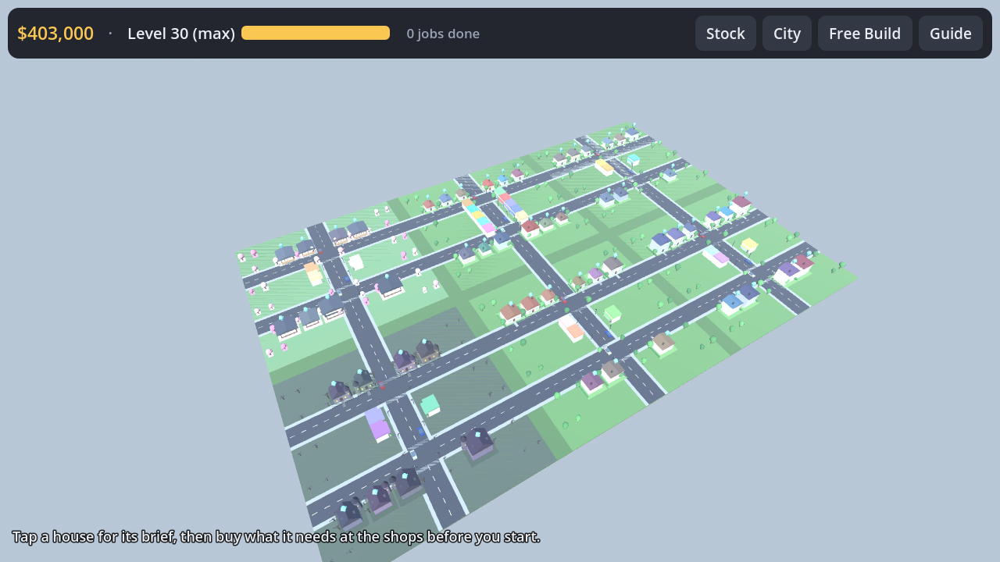

| Reading a brief | Buying on the shop floor |
|---|---|
| 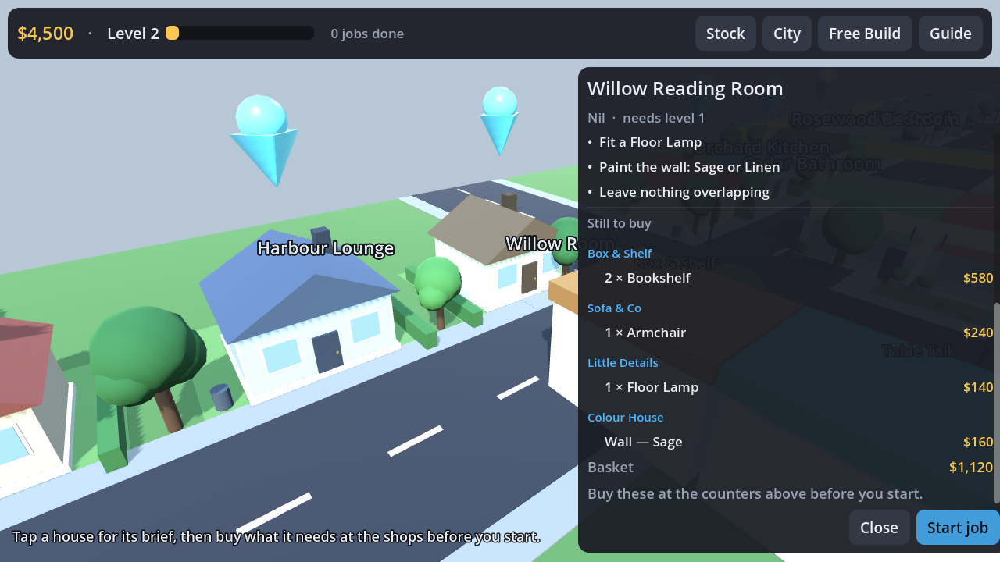 | 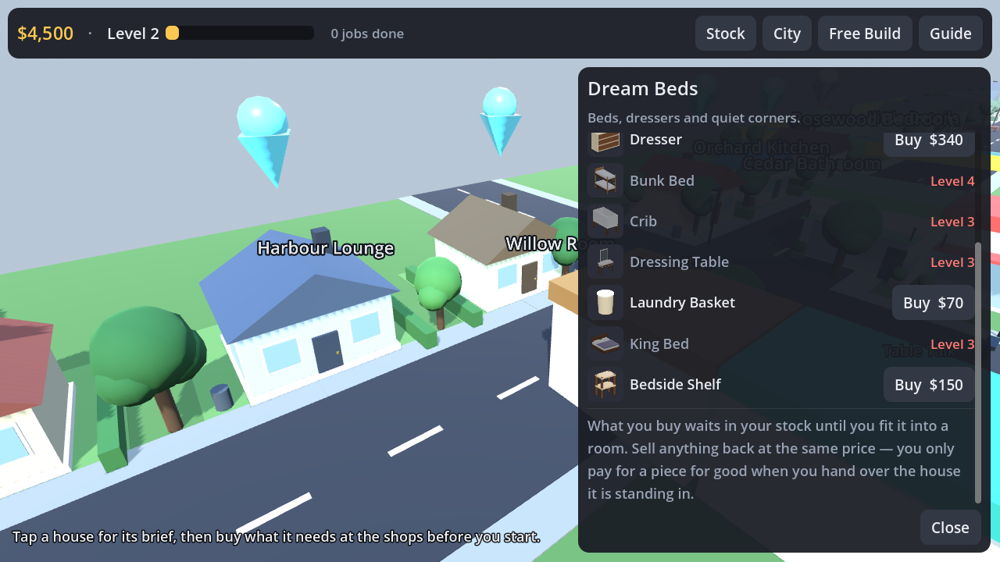 |

| Your stock | Fitting the room out |
|---|---|
| 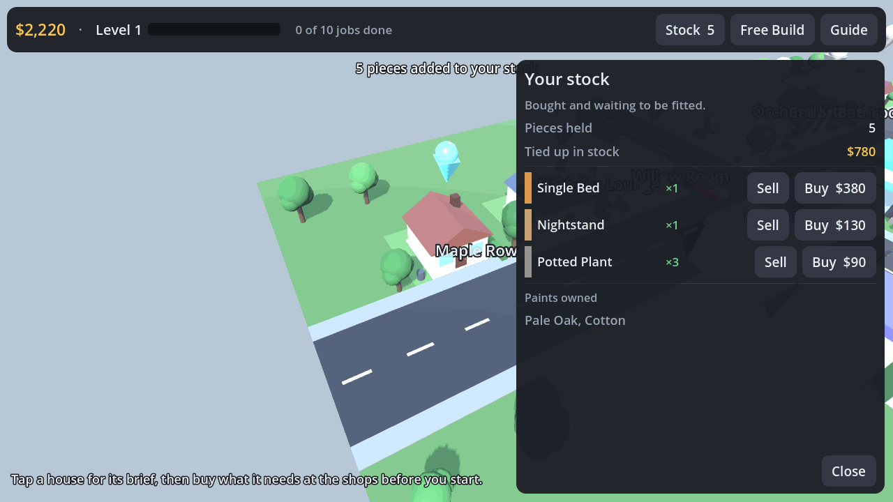 | 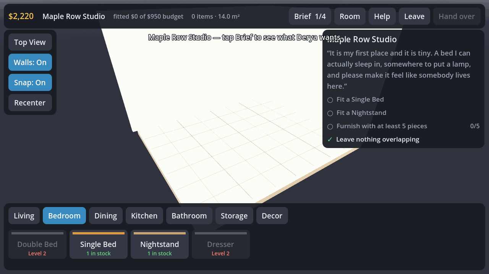 |

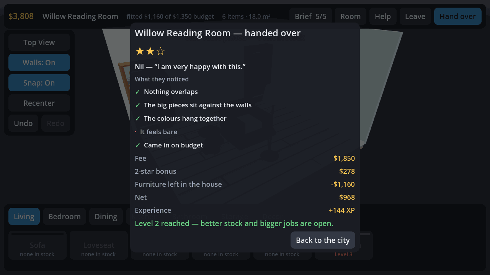

## Getting the app

Grab `room-designer-3d.apk` from the [latest release](../../releases/latest) and open it on
your device. Android asks you to allow installs from an unknown source the first time.
Releases from 1.12.0 onwards are signed with the same key, so each one installs straight
over the last.

- **Minimum Android:** 7.0 (API 24)
- **ABIs:** `arm64-v8a`, `armeabi-v7a`
- **Permissions:** none — the app never touches the network or your files outside its own
  storage

## Playing

### The city

The map is six quarters laid out on a grid, joined by the roads between them.

| Quarter | Costs | Opens at | Houses | Shops | Fees |
|---|---|---|---|---|---|
| Maple Quarter | — | level 1 | 12 | 10 | $1,300 – $10,500 |
| Riverside Wharf | $18,000 | level 7 | 9 | 3 | $4,900 – $9,500 |
| Hillside Terrace | $36,000 | level 11 | 9 | 3 | $5,200 – $13,000 |
| Skyline Heights | $58,000 | level 15 | 10 | 3 | $8,800 – $24,800 |
| Hanami Ward | $68,000 | level 19 | 8 | 3 | $5,600 – $17,500 |
| Hollow Row | $98,000 | level 24 | 8 | 3 | $11,200 – $29,000 |

Maple Quarter comes with the business — twelve houses along two residential streets, with
the ten shops down the avenue between them. The other five sit behind builders' hoardings
in a drained-out grey, with the asking price on a sign in the middle, and each has its own
parade of shops that will not serve you until you hold the deeds. You can fly the camera
over them from the first minute; you just cannot work or shop there.

The last two are not more of the same street. Each is built to its own pattern, plants its
own trees and trades in furniture sold nowhere else in the city.

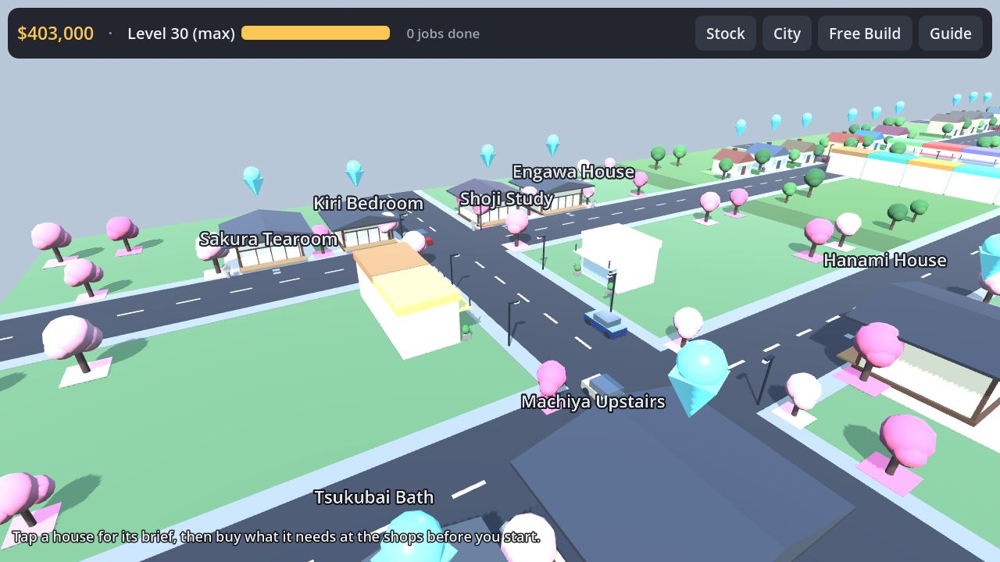

**Hanami Ward** is machiya — timber townhouses under a broad tiled roof with eaves deep
enough to stand under, a plank veranda along the front and paper panels where the windows
would be. A stone lantern on every plot, cherry along both streets, and blossom on the
ground under it. Its three shops — Tatami & Tokonoma, Washi & Lantern, Kiri Tansu — furnish
a room from the floor up: rush matting, a table you kneel at, a chest joined and pegged to
outlive the house. The briefs here are about restraint. One of them tells you to keep the
front room bare and means it.

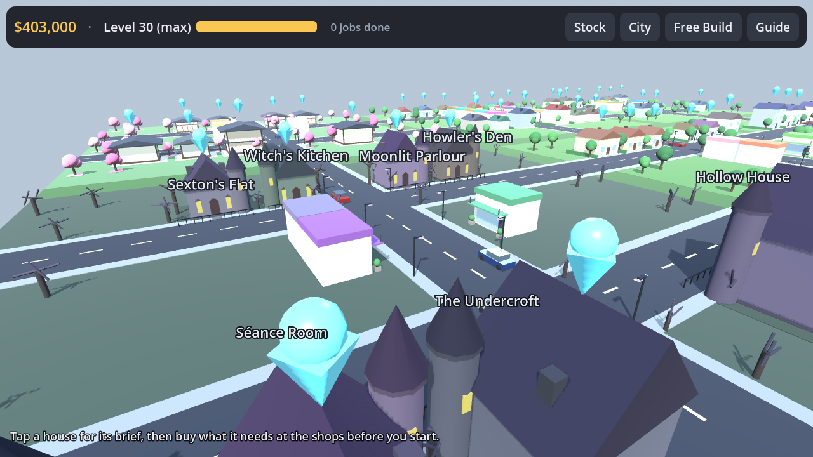

**Hollow Row** is the old row at the edge of the map. Steep slate, a corner tower with a
spire, tall thin windows lit from inside, iron railings and a dead tree leaning over every
plot. The street lamps burn violet and nothing has been painted this century. Crypt &
Coffer, The Cauldron and Gargoyle & Gloom serve a sexton, a witch, a werewolf and a family
that has been at the end of the row three hundred years. Deliveries after dark.

| The hoarding round a quarter you have not bought | What it is asking for |
|---|---|
| 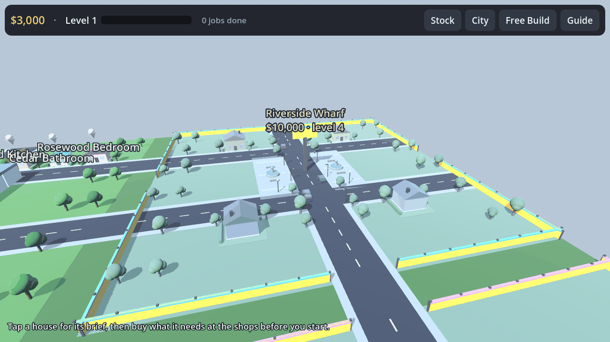 | 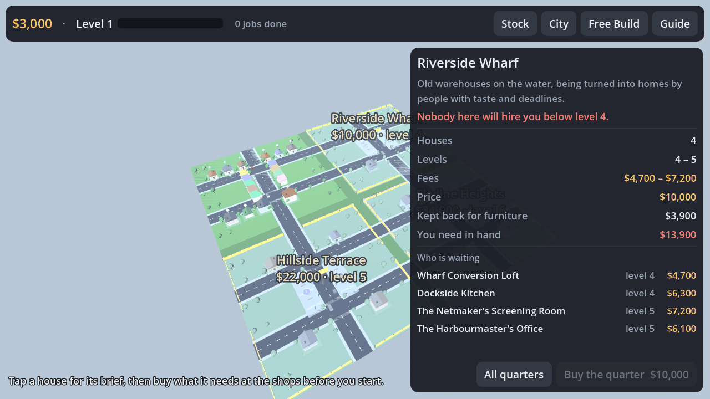 |

Buying is outright and permanent, and it costs the price **plus** enough working money to
shop for the cheapest brief inside — otherwise you could sign the cheque and be left unable
to afford a single sofa. The sheet spells out all three figures before you commit.

The briefs get longer as you go: ten lines instead of four, six shops represented instead of
three, thirty pieces in a room instead of five. One house in Skyline Heights wants something
from every shop in the city.

### The map is not a diagram

Traffic runs the length of the city: the quarters share a road grid and the link
roads join it up, so a car leaving Maple carries on into Riverside rather than stopping at
the boundary. Cars are evenly spaced and every car on a lane holds the lane's speed, which
is the cheap way to stop the quick ones catching the slow ones and driving through them.
People walk the pavements outside the shops and turn round at the ends. Both quarters that
have weather get it: blossom drifts down across Hanami all day, and something circles over
Hollow Row.

None of it is a node. Five hundred-odd moving things across four shapes are drawn as nine
MultiMeshes — nine draw calls and about half a millisecond of transform writes a frame,
against five hundred nodes each with its own script. The static city is still welded into
three meshes underneath; this is the layer that moves over the top.

A map is looked at from above, so what it is mostly made of is roofs and grass, and both of
those used to be flat colour. A shop's roof was one slab in the shop's own colour, which
from map height read as a sheet of paint lying on the ground rather than as a building; it
is a felted deck now, with a plant room, ducting, a rooflight and vents on it, and the shop's
colour kept to a band round the parapet and the fascia over the window, where you read it
from. The colour is knocked back a quarter on the building too — ten shops at full strength
was a row of neon, and the sign and the map pin carry the identity anyway. House roofs get
what says tile from above: courses up each slope, a ridge along the top and barge boards down
the gable ends. And the field the whole quarter stands on is mown in patches, seeded off the
quarter's own position so it looks the same every time it is built, with bushes and stones
scattered over the parts nothing else uses.

The two maps out of town got the same going over. A camp on a holding has a stone plinth, a
tiled roof, windows with sills, a capped chimney, a woodpile along the gable and a water butt
on the corner. A works has a brick plinth, a sheeted roof, a roller shutter with a lintel,
steel windows and a gutter down the long side, and its chimney stands on the building rather
than out in the yard on its own. What it makes is stacked on pallets, with a hopper on legs
and a skip by the gate. And both fields and yard are weathered the way the quarters are —
mown patches and bushes on the one, worn concrete, weeds through the cracks and pallets left
out on the other.

### Whole floors

Most jobs are one room. Seventeen of them are a whole floor — two to five rooms with walls and
doorways between them — and their briefs say which room each thing belongs in. A bed in the
bathroom does not tick the bedroom's line.

| Five rooms, seen from the south | …and from the north |
|---|---|
| 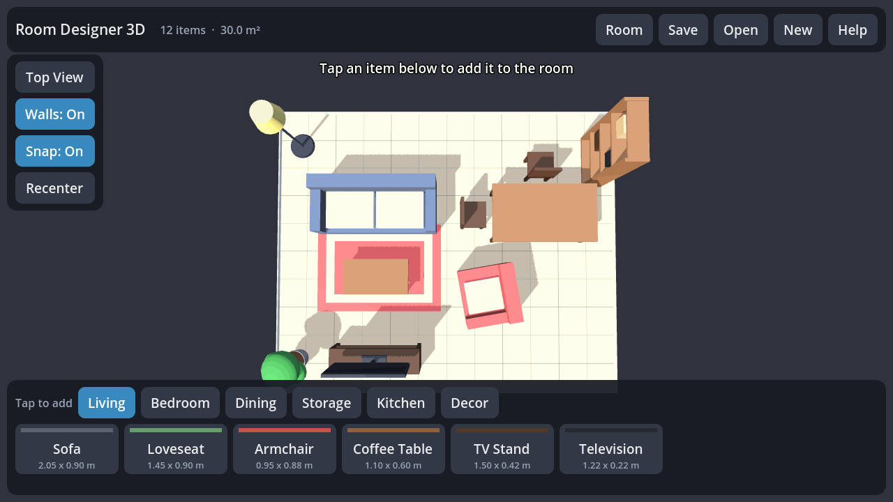 | 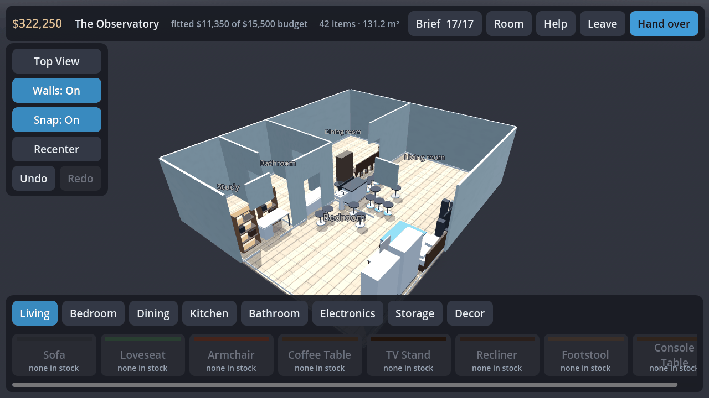 |

Walls drop out of the way wherever they stand between you and the inside of the flat, so
every room stays visible however you orbit — and each one is named where it sits. Drag a
piece across a dividing wall and it moves to the room on the other side; you do not have to
thread it through the doorway with a fingertip. Wall snap, the grid and the star review all
work room by room, so a sofa against the living room's partition counts as against a wall.

**Paint is per room too.** The Room panel puts the plan's rooms across the top: pick one and
the swatches below lay a floor or paint walls in that room alone, or pick *All rooms* to do
the whole floor at once. A dividing wall is two faces, so the kitchen can be Storm on its
side while the living room stays Linen on the other.

| Five rooms, five schemes | Choosing which room to paint |
|---|---|
| 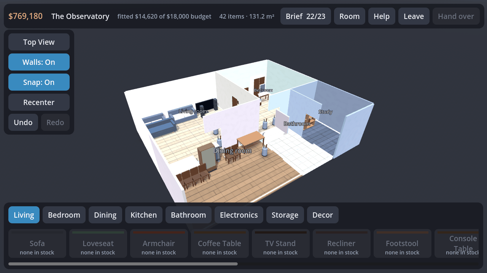 | 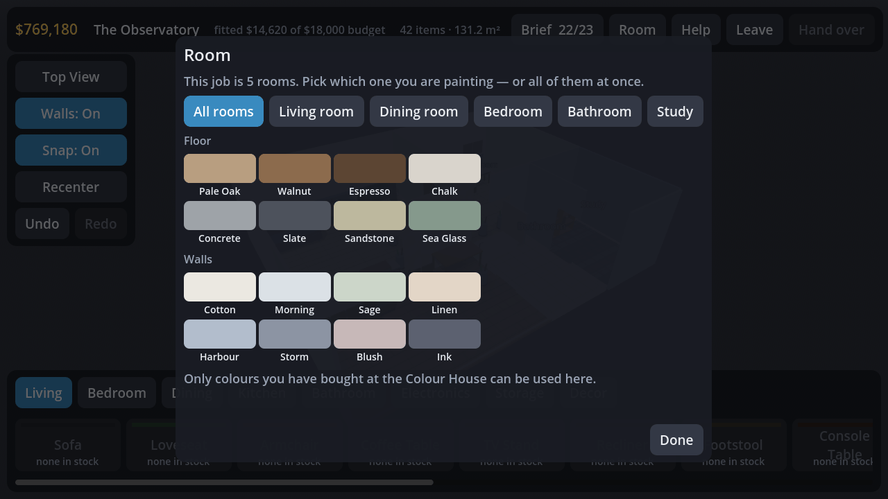 |

A brief can ask for a colour in a named room — *lay the bathroom floor in Chalk or
Sandstone* — or leave the room out, which means every room in the flat has to match.

| Job | Rooms | Floor |
|---|---|---|
| The Alder Street Flat | living room, bedroom | 26 m² |
| The Cooperage Flat | living room, bedroom | 39 m² |
| The Granary Duplex | living room, kitchen, bathroom | 48 m² |
| Beacon House Ground Floor | living room, kitchen, bedroom | 75 m² |
| Fell View, Upstairs | living room, dining room, bedroom, bathroom | 84 m² |
| Cloud Court, Floor 22 | living room, kitchen, bedroom, study | 114 m² |
| The Observatory | living room, dining room, bedroom, bathroom, study | 131 m² |
| Tide House, Ground Floor | living room, kitchen | 43 m² |
| Zenith Guest Suite | bedroom, bathroom | 48 m² |
| Heather House, Upstairs | bedroom, children's room, bathroom | 47 m² |
| The Apex Residence | living room, dining room, bedroom, study | 114 m² |
| The Engawa House | guest room, living room | 45 m² |
| The Machiya, Upstairs | bedroom, dining room, store room | 58 m² |
| The Hanami House | tea room, bedroom, living room, study | 80 m² |
| The Howler's Den | living room, bedroom | 52 m² |
| The Undercroft | bedroom, kitchen, study | 72 m² |
| Hollow House | living room, bedroom, kitchen, study | 95 m² |

A floating pin over each house in a quarter you own tells you where it stands:

| Pin | Meaning |
|---|---|
| Blue | Available — tap for the brief |
| Amber | Started, furniture already bought |
| Green | Handed over |
| Grey | Locked until you reach the level shown |

### Going shopping

Tapping a shop on the map shows you its window — what is on the floor, at a glance — and a
door. **Go in** and you are standing in the shop.

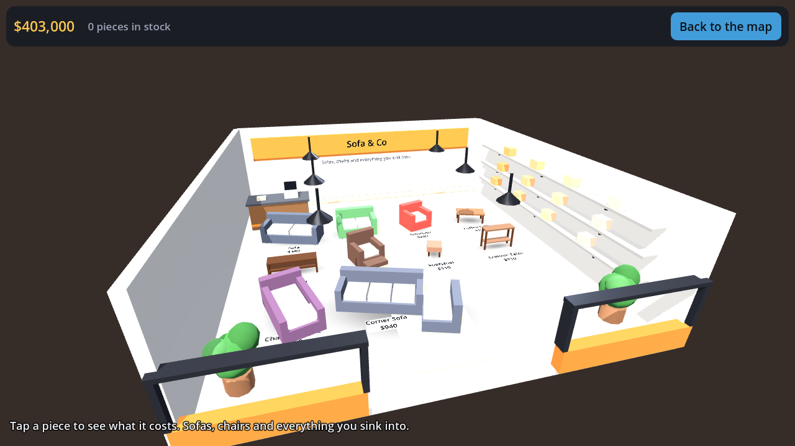

Everything the shop sells is out on the floor where you can walk round it, with a ticket in
front of each piece giving its name and price. Nothing is bought from a list: you tap the
piece itself, and a card tells you what it is, what it costs and how many you already own,
with **Buy** and **Sell one** on it. A piece you cannot buy yet is still put out, drained of
colour, with what it is waiting for on the ticket — a level, or a quarter of the city you do
not own.

The floor is laid out to be read rather than on a fixed grid. Rows are spaced by how deep
the pieces in them actually are, tall stock stands at the back the way a showroom does it,
and each ticket is on a stand tall enough to be seen over its own piece — so a corner sofa
never parks itself across the price of the thing behind it. The shop is built as deep as its
stock needs, and the pendants hang out to the sides, clear of the tickets.

The shop is dressed like a shop: a counter with a till, wall shelving, pendant lights, plants
by the door, a shopfront with the trade's colour on the sill, and the shop's own name and
tagline over the back wall.

The Colour House works the same way, except its floor is racks of tins rather than rows of
furniture. Tap a tin to see the shade and its price; a colour is bought once and is then
yours to use in every room forever.

**Yardley & Sons** — the builders' merchant, on the same parade from level 3 — is the one
shop that sells nothing you can put in a room. Its floor is four pallets of trade material:
lumber, bolt cloth, steel section and sheet glass, each priced by the unit. Tap a pallet and
the card gives the price, how much of it is in your store and buttons for one, ten or fifty.
That material is not for a room; it is for the workshop out of town, which is where it turns
into furniture. Like everything else, it sells back for exactly what it cost.

Anything you own can be sold straight back at the price you paid, either off the shop floor
or from **Stock** in the top bar.

**Stock** in the top bar is your warehouse: everything bought and not yet fitted, with the
money tied up in it.

### Money, stock and the room

Money only ever moves in the city. Inside a room you spend *stock*, never cash:

1. **Buy** furniture at a shop — it goes into your warehouse.
2. **Place** it in a client's room — it leaves the warehouse.
3. **Put it back** and it returns to the warehouse, ready for the next house.
4. **Hand the job over** and the pieces standing in that room stay with the client. That is
   the moment they are finally paid for.

Nothing is ever wasted: a piece is only spent for good when a client keeps it, and until
then you can always sell it back for what you paid. That also means you can never be
stranded with no money and no way out.

### A job

The briefing sheet gives you the client's words, the room size, the fee, their budget and
the experience on offer. Under the brief it lists exactly what you are still missing, item
by item with a price against each and the basket total at the bottom — **grouped by the shop
that sells it**, so the list reads as a round of the city rather than a heap of names. Once
you own more than one quarter each heading says which quarter to drive to as well. It is a
shopping list, not a basket: you buy each piece at its own counter.

Take the job and you land in the room with the brief checklist on the right; it re-ticks
itself live as you work. Once every line is ticked, **Hand over** collects the fee — and the
client's verdict.

The catalogue lives behind the **Furniture** bar along the bottom, closed to begin with so
the room has the screen to itself. Tap it and the tray comes up: the pieces split by
category, each showing a picture of itself and how many you have left rather than a price.
Tap the bar again — or press Back — to put it away.

Both strips are dragged rather than scrolled. Put a finger anywhere on the row, including
on a piece, and slide: the row follows and coasts on when you let go. A press that stays
put is a tap and places the piece; one that wanders more than ten pixels is a drag and
places nothing.

| Closed, which is how a room opens | Open |
|---|---|
|  | 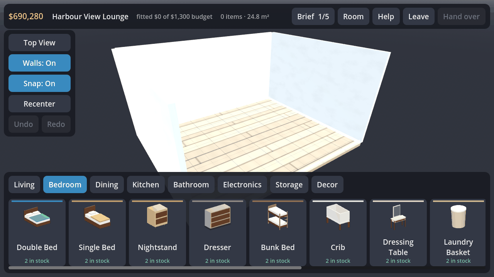 |

Nothing in the project is an art file, so those thumbnails are rendered rather than drawn:
one small off-screen viewport mounts a piece, draws it once, and keeps the result for the
rest of the session. It works through a tab one piece per frame in the background, so the
first look at a category fills in over about a quarter of a second instead of stalling on
twenty renders at once.

### A brief is a problem, not a docket

A brief used to name products. Seventy per cent of every line in the game was
*"Fit 4 × Tatami Mat"* — you flew to five shops, tapped seventeen Buy buttons and put
seventeen things down, and the only decisions left were where each one went and what colour
to tint it. That is a courier's job, and it wasted a 167-piece catalogue as a lookup table.

Most lines now say what the room has to be able to **do**:

| | |
|---|---|
| Seating for four | Anything anyone can sit on, in any combination |
| Somewhere to sleep | A bed, a bunk, a futon, a hammock |
| Two surfaces to put things down on | Anything with a usable top |
| Somewhere to put things away | Storage of any kind |
| A light to read by | Any lamp, lantern or fitting |
| Something green | Anything that grows |

What a piece does is worked out from what was already known about it — its category,
whether anything can stand on it, and what it is called — with a table for the ones no rule
would get right. A bookshelf is a surface **and** somewhere to put things away, so it answers
two lines with one piece; a corner sofa seats five where a chair seats one.

Some things are still named, because there is no creative substitute for them: plumbing,
white goods, a television, a particular rug. Thirty-nine of the fifty-six houses ask for what
they need; the seventeen whole-floor jobs still name their pieces room by room, and that is
the next thing to convert.

The brief sheet still offers a shopping list, but it is now a **suggestion** rather than the
answer. It works a room at a time and picks whatever covers the most of what is still
missing, cheapest of equals — which is how it lands on three bookshelves for a study rather
than three side tables and three laundry baskets. Ignore it and buy something else; the room
is judged on what it does, not on what you bought.

### The verdict

The brief only says what has to be *in* the room. The stars say whether it is any good.
Six things a person notices walking in, each either satisfied or not:

| | |
|---|---|
| Nothing overlaps | No piece is jammed into another |
| The big pieces sit against the walls | Sofas, beds, wardrobes and the like belong at the edges — at least 70 % of them |
| The colours hang together | Four distinct tints across the room, at most |
| There is room to move | Furniture covers between 12 % and 55 % of the floor |
| The room has a point of view | One school of furniture rather than six — see below |
| Came in on budget | What you left behind cost no more than the client allowed |

Five out of six is three stars and a 30 % bonus on the fee; three or four is two stars and
15 %; below that, one star and no bonus. Stars scale the experience too. Following the
checklist gets you paid — arranging the room properly is what earns the third star.

### What the furniture says

Five of those six lines are about whether the room *works*. The sixth is the only one about
taste, and it is the one that turns a job from a shopping run into a design.

Every piece belongs to a school, and nothing new had to be invented to decide which: each
quarter of the city already trades in its own kind of furniture, so a piece is of the school
of the quarter that sells it.

| School | Where it comes from | |
|---|---|---|
| Plain | Maple Quarter | Everyday stock. It sits happily next to anything |
| Salvage | Riverside Wharf | Off the dock. Iron, rope and things that were something else |
| Cottage | Hillside Terrace, and Attic & Loft | Worn wood, soft edges, something growing in the corner |
| Gallery | Skyline Heights | Stone, glass and a lot of nothing between the pieces |
| Japandi | Hanami Ward | Low, light and pared back to what the room actually needs |
| Gothic | Hollow Row | Dark timber, tall backs and candlelight |

**Plain has no opinion** and is left out of the sum entirely — that is the point of it. Of
the pieces that do have one, seven in ten have to agree with each other, or the client walks
in and sees a jumble. Attic & Loft stands on Maple's avenue but sells nothing made this
century, which gives the first quarter one place to buy furniture with a view.

And every client wants the look of the street they live on, said out loud on the brief:
*"Nozomi has a soft spot for japandi."* Furnish the room in the school they actually like and
it pays **5 % over the fee**, on top of whatever the stars earned. Somebody in Maple has no
strong feelings and will take anything, as long as it agrees with itself.

| Gesture | Result |
|---|---|
| Tap an item in the tray | Takes one out of stock and drops it into the room |
| Tap a piece of furniture | Selects it |
| Drag a selected piece | Slides it along the floor, kept inside the walls |
| Drag it near a wall | Sits flush against the wall and squares up to it |
| Drag a lamp, vase or TV over a table | Lands on top of it |
| Twist two fingers over a selection | Turns it; spreading them resizes it |
| Drag empty space | Orbits the camera |
| Pinch | Zooms |
| Two-finger drag | Pans across the floor |
| Drag the tray sideways | Slides along the catalogue; a tap still places |
| Double tap | Brings the camera to what you tapped |
| Back button | Closes the dialog, then the catalogue, then clears the selection, then leaves |

From the city, Back returns to the title screen; from there it leaves the game.

**Undo** and **Redo** on the left go back through everything and move furniture between the
room and your stock as they go. The bar under a selection rotates in 15° steps, flips 180°,
scales between 50 % and 200 %, recolours, duplicates and puts back. **Top View** switches to
a plan view and drops the walls; **Snap** toggles the 25 cm grid. Walls between you and the
room hide themselves as you orbit, and a piece that overlaps another glows red.

### Out of town

Everything below is on **one map out of town**, reached by the **Estate** button in the top
bar from level 3. It used to be two screens — the ground on one and the works on the other —
which meant the half that grows things and the half that makes things were never in front of
you at once, and the growing half had nothing to decide once the ground was bought. One road
runs the length of it now: holdings down the west end, works down the east, and the workshop
at the end of the road.

**The holdings** are eight plots either side of that road — two woods, two fields, two
hills and two dunes — and each of them yields one of the four raw materials. These are the
fine stuff, and they are deliberately nothing like what the merchant sells: figured walnut
by the boule, raw silk by the hank, wrought iron by the billet, lead crystal by the batch.
Nothing off your own land ever makes an ordinary piece of furniture — it only makes one
*better*. Tap unworked ground to see what it would hand you and what the
agent wants for it. Buy it and a camp goes up: a hut, a yard, a cart, logs stacked by the
track. Buy it again to work it up, twice more, and the camp grows each time while the rate
rises with it.

**The estate runs on a clock.** A holding you own fills whether the app is open or not — a
tier-1 elm stand at four logs an hour, the same stand worked up twice at eight — and the map
shows how much is standing on each one. Nothing ticks in the background: the game asks the
wall clock what time it is when you look, so a night away and a night watching it come to the
same thing.

Two caps keep it honest. **A holding only holds eight hours' worth** and then stops, so
there is a reason to look in twice a day rather than once a fortnight. And **the yard only
holds so much of a material** — thirty to begin with, and fifteen more for every tier of
every holding that yields it, so storage is something you build rather than a number you are
handed. Cart a holding off into a full yard and it takes what it can; the rest stays in the
ground until there is room.

**The works** are the east end of the same road: a sawmill, a weaving shed, a foundry and a glasshouse
standing along it, with the workshop at the end. Each plant takes three of one
material and turns it into one finished good — a burr panel, a bolt of silk, a forged fitting,
a crystal pane. **A run takes real time**: fifteen minutes at the sawmill up to forty at the
glasshouse. The material goes in when you put the run on — it is in the machine, not in the
yard — and the goods come off when it is done. Building a plant up puts one more through the
same run rather than making the run quicker, so a tier-3 sawmill makes three boards in the
same fifteen minutes. Each works has a store of its own, and a full store will not take a run.

**The workshop** stands where the road stops, and it does the two things a workshop does.
The sheet has a tab for each.

**Improve** is where the goods go into the furniture. It lists everything in your
warehouse with what the next step up would take, and improving a piece lifts **every one of
that kind you own** — and everything of that kind you come by afterwards. There are three
steps:

| Step | Goods | Bench fee |
|---|---|---|
| Improved | 2 | a quarter of the piece's price |
| Fine | 4 | half of it |
| Master | 7 | the price again |

Which good a piece wants is decided by what it is actually built from, weighed by area: a
sofa with four small wooden feet still wants silk, a bookshelf wants panel, a floor lamp
wants fittings, a mirror-fronted cabinet wants crystal.

**Make** is the other half, and it runs on the merchant's trade material rather than
anything off your own land — the two never meet, which is the point of them being two
different things. Pick a category, and every piece the shops would sell you today is listed
with what it takes to build and what building it saves:

- **The bill** comes from the piece itself. What it is made of comes off the part list —
  one material role per part, already there for the modelling — and how much of it comes off
  the price, because volume alone is hopeless: a sofa's body is bulkier than a wardrobe and
  it is not a hundred bolts of cloth. So the proportions are the model's and the total is
  the price's, and all 167 pieces are in the same economy without a line of it being written
  by hand.
- **The saving is the same for everything.** Material comes to between half and two thirds
  of the shelf price whatever the piece is. Getting there means costing the *mix* first:
  glass is nearly twice the price of timber, so handing out a flat number of units per
  dollar had a glazed cabinet cost four fifths of its price to make and a wooden one a
  third. The units are worked back from what they cost instead, and handed out by largest
  remainder so the bill comes to exactly the count that was costed.
- **Making takes real time**, on the same wall clock as everything else out here: four
  minutes for a chair up to three quarters of an hour for the dearest thing in the city.
  One piece at a time; start a second and it queues behind the first.
- The material goes in **when you start**, not when you collect — it is in the piece, not in
  the store. What comes off the bench goes straight into the warehouse, and **making
  something teaches you as much as fitting it does**, so the workshop is experience as well
  as money.

The trade store has no cap and does not fill on its own — it is a lorry from the merchant,
not a crop — so it sits apart from the yard tally along the top of the map.

No part of the estate costs money to run: the land and the plant are bought once each, and
after that a run costs material and a wait, never cash. The repeating charges are the bench
fee and whatever you spend at the merchant.

The point of all of it is the hand-over. Every improved piece standing in a finished room
adds 6 % per step to the fee **and** to the experience, averaged across everything in the
room — so a room furnished entirely with Master work pays 18 % over the asking fee and
teaches you 18 % more. That is on top of whatever the client's review earned you.

### Changing screens

Nothing in the game is a saved scene, so every screen is built the moment you ask for it —
the map welds a few thousand pieces of scenery into batched meshes, and a five-room job lays
out its floor plan and stands every piece you left there back up. That is real work, and it
used to happen with the last frame of the old screen frozen on the display.

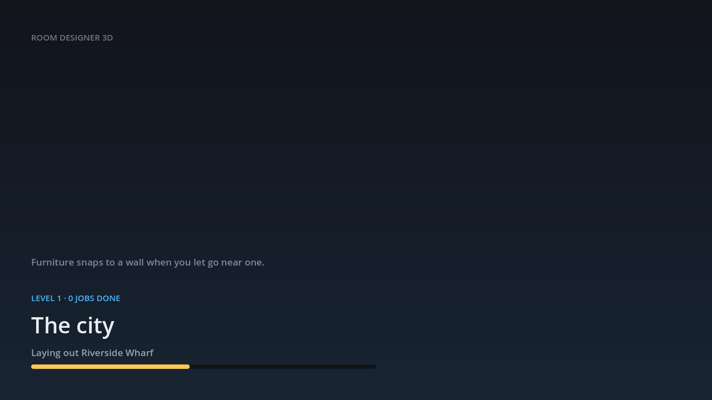

Now a loading screen goes up first and is given a frame to actually paint before the old
screen comes down, so there is never a blank frame between the two. The build then runs one
stage per frame underneath it — the map a quarter at a time, a job through its shell, its
walls, its tools and its furniture — and each stage names itself as it starts, so the bar
moves for a reason rather than on a timer. When it reaches the end the new screen is left to
draw a few more frames behind the overlay, which is where the first shader compiles land,
and only then does the overlay fade away.

### Sound

There are no audio files in this project either. Every sound is synthesised at runtime from
oscillators, noise and envelopes — seventeen cues in about 320 KB, and a bed of music in
another 690 KB, all built the moment the app starts.

| | |
|---|---|
| Interface | A tick on every button, and a pair of rising and falling blips for a panel opening and closing |
| The room | A piece landing is a low tone dropping a fifth with a knock of filtered noise on the front; picking one up is a thin blip, putting it back a heavier one, and painting a wall a brush of filtered noise |
| Money | A two-note rise at a counter, the same two notes falling when you sell something back |
| Refusals | A short double buzz — not enough money, nothing in stock, or a level you have not reached |
| Rewards | Struck bells, one note for one star and three for three, a four-note run for a level and a five-note one for a quarter of the city |

The cues are levelled by loudness rather than by peak. A square-wave buzz and a struck bell
with the same peak are nothing like as loud as each other — the buzz spends all its time at
full swing and the bell almost none — so matching the average is what stops "you cannot
afford that" shouting over everything else. Measured across the bank they now sit within
21 % of one another.

The music is four slow chords in D, sixteen seconds long and looped, four gently detuned
voices to a chord. The cues are drawn from the same four chords, so a purchase or a level-up
lands inside the music rather than against it.

Synthesis is not free — the bank is about a third of a second on a desktop and the music
twice that again — so the PCM is built on a worker thread and picked up when it is ready.
Nothing blocks the first frame. Until the bank lands, a tap or two on the front page is
silent, and that is the whole cost. Only the raw samples are made on the thread; the streams
themselves are Resources and are built on the main one.

Two details are about Android rather than taste. Every buffer ends in sixteen frames of
silence, because the mixer interpolates between a sample and the one after it and so reads
one frame past whatever it is playing — and the music's loop point stops short of that
guard, since `loop_end` is inclusive. Pointing it at the last frame, which is what 1.18.0
did, makes the mixer read off the end of the buffer every time round the loop. On a desktop
that lands in slack memory and nobody notices; on Android it is an out-of-bounds read on the
thread feeding AudioTrack, and the app goes down where nothing can catch it.

There is a dead man's switch behind that. A flag is written while the bed is playing and
cleared on the way out, so a run that finds the flag still set knows the last one did not end
well and starts with the music off, saying so on the front page. Nobody ends up in a loop of
launching an app that dies two seconds later.

### Progress

Experience carries you from level 1 to level 30, and it is meant to last the whole city.
The fifty-six houses are worth about 46,000 experience at two stars apiece; the thirty
levels cost 45,414 between them. So a competent run arrives at the cap on the fifty-sixth
and last house, a three-star run gets there a few houses early, and a scrappier one finishes
it off with repeat work. Every level from 1 to 29 opens something — a quarter, a shop, a
tier of stock, a paint, or the next houses on the map — and 30 is the top of the ladder.

| Level | What opens |
|---|---|
| 1 | Maple Quarter, its six starting shops, 21 pieces, 8 paints, and the first two briefs |
| 3 | Kitchen Works, Splash & Tile, Volt & Wire — 34 more pieces |
| 5 | Attic & Loft, and 26 pieces including the baths and the bigger beds |
| 7 | **Riverside Wharf** goes on sale |
| 8 | Dock & Salvage, Ropewalk & Co, The Chandlery — the wharf's own trade |
| 11 | **Hillside Terrace**, plus Hearth & Home, The Potting Shed, The Toy Cupboard |
| 14 | Atelier Nine, Lumen, Vitrine — the last 17 pieces in the city |
| 15 | **Skyline Heights** |
| 19 | **Hanami Ward**, plus Tatami & Tokonoma, Washi & Lantern, Kiri Tansu — 15 pieces |
| 24 | **Hollow Row**, plus Crypt & Coffer, The Cauldron, Gargoyle & Gloom — 14 pieces |
| 2, 4, 6, 9, 10, 12, 13, 16–18, 20–23, 25–29 | The next houses on the map, and the mid-range paints |

Jobs run from a $1,300 studio to a $29,000
haunted house. A run that buys only what each brief asks for clears Maple Quarter with
around $31,000 — enough to buy Riverside outright — and owns the whole city, all 56 houses
handed over, with about $115,000 left. Owning every quarter costs $278,000 in total. Everything — money, level, stock, paints, the quarters you
have bought, finished jobs and the rooms you left half-done — is saved to the device as you
go.

The map does not run out. Open a house you have already handed over and the owner has a
fresh room in mind — a kitchen, a study, a media room — generated to suit the level you have
reached, with its own client, brief, budget and fee. That is how you save up for the last
quarter when the handcrafted work runs dry.

### Your trade

A level used to be a key and nothing else: it unlocked a shop, a quarter, a holding, and
two players at level 20 had exactly the same business. **Trade** in the top bar is the other
half of it. Every level hands you one point, and a point buys the next step of one of four
lines — the four things a person in this trade can be good at:

| Line | Eight steps buy |
|---|---|
| **Haggler** | 16 % off everything in the shops — furniture, paint and trade material alike |
| **Stager** | 12 % on every fee, on top of whatever the client's own review earned |
| **Scholar** | 24 % more experience from every job |
| **Grafter** | 32 % faster out of town, and two more places on the workshop bench |

Each line has eight steps and each step has a name, so a decision reads back as one — *A
trade account*, *A page in the trade press*, *Take an apprentice*, *Three at the bench*.
Steps have a level of their own as well as a price in points, so no line can be finished
early: the eighth of anything opens at level 23.

**There are thirty-two steps and twenty-nine levels.** The tree is three short of
affordable on purpose, and nothing here can be given back — so what you leave out is as
much a decision as what you take. A run that spreads its points evenly across the four
finishes the city about $60,000 better off than one that never opens the sheet.

Haggling reaches every price in the game the moment you take a step: the tickets on a shop
floor, the card for a piece, the basket total under a brief, the yard's pallets, and the
value of your own warehouse. What you sell back is worth exactly what buying it again would
cost you, so a mistake at the shop is still free.

### Staff

The second tab of the same sheet is the opposite of the first on every axis. The perk tree
is what *you* got better at: free, permanent, paid for in points. **Staff** are four people
who do a chore you would otherwise be tapping through by hand, hired and let go whenever
you like, and paid out of every fee for as long as they are on the books.

| | Opens at | Takes | Does |
|---|---|---|---|
| **Rosa**, runner | 6 | 4 % | Puts a button on a brief that buys everything still missing, from every shop at once |
| **Tomas**, yard hand | 8 | 3 % | Carts every holding in as it fills, and a heap he is working holds three times as much before the ground stops |
| **Ada**, millwright | 12 | 3 % | Takes each finished run off and puts the next one on, at every works that has the material |
| **Petar**, joiner | 15 | 4 % | Keeps the workshop bench going: whatever came off it last goes back on, while the trade store can pay for it |

**Nobody is paid by the hour.** A wage on the wall clock would mean coming back from a
fortnight away to an empty account, which is a punishment for having a life. Everyone takes
a share of every fee instead, so four people cost you nothing at all until you are actually
paid — and the share is itemised on the hand-over screen with everything else. Taking
somebody on costs a joining fee that rises with your level; letting them go is free and
stops the share at once, so the books are a dial rather than a trap. Hire the joiner for a
week at the bench and let him go again.

None of them makes a decision for you. Where a piece goes, what colour it is and what a
room is *for* stay yours — they only do the walking. And Tomas cannot make the yard itself
bigger: storage is the one ceiling that has to be built rather than hired.

Played with all four on the books and points spread evenly across the perk tree, a full
career ends on about $154,000 — against $255,000 for the same run with the tree spent and
the books empty. The convenience is real and so is the bill.

### Your showroom

The third tab, from level 10, is a room of your own. Every other room in the game belongs to
somebody else — you fit it out, hand it over, and the furniture goes with it. This one keeps
whatever you stand in it and pays for as long as it is dressed.

**Go in** opens the designer on a floor with no brief and nobody to hand it to. It runs by a
job's rules rather than the sandbox's: the tray greys out what you do not own, and a piece
you place leaves the warehouse. Pull it back off the floor and it returns, so nothing is
ever lost — but while it is standing there it is not available for a client, and that is the
whole cost of the feature. The room is yours to resize, which no client's room is.

**What it takes an hour is the room's own review.** Up to here the six-point verdict fired
once at a hand-over and was never heard from again; here it is the multiplier on everything
the floor earns, every hour, until you change it:

    takings = what is standing there × 1.2% × how well it reads × how many counters

Stars are worth ×0.6, ×1.0 and ×1.5, and the spread runs from ×0.8 for a floor out of one
shop to ×1.3 for six. A floor of fewer than four pieces, or one nobody would walk into,
takes nothing at all. **A cheap floor arranged well beats an expensive one thrown
together** — which is the only thing about this worth getting good at, and the reason it is
the room and not the receipt that pays.

The bar along the top of the designer shows it moving as you work: what is on the floor,
what it reads as, and what that is an hour. The till fills on the same wall clock as the
estate and stops after a trading day, so a showroom is something to look in on rather than
something to farm. **Trade** in the top bar shows what is in it.

**Free Build** on the map opens the old sandbox: no client, no stock to worry about,
everything unlocked, with its own save and load.

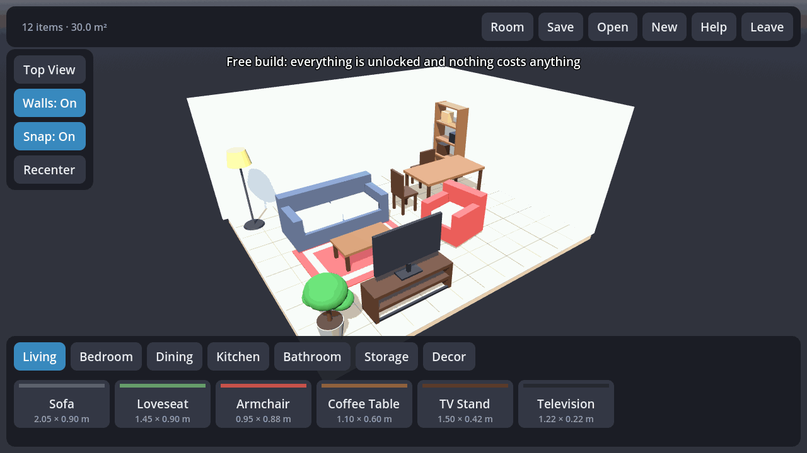

## The catalogue

167 pieces across twenty-five shops, all built from primitives at runtime, $45 to $1,980 each.

Every piece is a list of boxes and cylinders, but not plain ones. A hard ninety-degree edge
puts two faces at right angles with nothing between them, so nothing in the room ever catches
a highlight and every piece comes out looking like a crate — which is what the catalogue used
to look like. So each box has a couple of millimetres taken off its edges, the way a real
piece of furniture does, and gets a lit rim for it. On top of that a part can ask to be
**soft**, which rounds it much further and shades the rounding as a curve — that is the
difference between a cushion and a block — or to **taper**, which narrows it towards the
floor and is most of what makes a leg read as a leg. The chamfer is cut inside the box and a
taper only ever narrows it, so a piece measures exactly what it always did and nothing that
places, stacks, prices or picks furniture had to change. It costs about 400 triangles a
piece: a furnished room runs to sixteen thousand, which a phone does not notice.

Ten of the shops stand on Maple Quarter's avenue:

| Shop | Opens | Stock |
|---|---|---|
| Sofa & Co | 1 | Sofa, loveseat, armchair, chaise longue, corner sofa, recliner, footstool, coffee table, console table, TV stand |
| Dream Beds | 1 | King bed, double bed, single bed, bunk bed, crib, nightstand, bedside shelf, dresser, dressing table, laundry basket |
| Table Talk | 1 | Dining table, round table, bistro table, kitchen island, chair, bar stool, dining bench, long bench |
| Box & Shelf | 1 | Wardrobe, bookshelf, ladder shelf, desk, low cabinet, filing cabinet, display cabinet, shoe rack, coat stand |
| Little Details | 1 | Rug, round rug, floor lamp, table lamp, potted plant, side table, partition, floor mirror, framed print, vase, stack of books, umbrella stand |
| Kitchen Works | 2 | Counter, refrigerator, stove, sink unit, dishwasher, range hood, kitchen trolley, pantry cupboard, kettle, toaster |
| Splash & Tile | 2 | Toilet, basin, bathtub, shower, corner shower, bath screen, washing machine, vanity unit, tall cabinet, towel rail, bath mat |
| Volt & Wire | 2 | Television, wide television, computer, floor speaker, soundbar, games console, turntable, printer, portable air con, floor fan, microwave, robot vacuum |
| Attic & Loft | 3 | Blanket box, stacked trunks, step ladder, hat stand, mantel clock |
| Colour House | 1 | Eight floor paints and eight wall paints, $160–$540 each |

The other nine stand on the avenues of the quarters you buy, and they will not serve anyone
who does not hold the deeds. Fifty-one pieces are sold nowhere else in the city:

| Shop | Quarter | Stock |
|---|---|---|
| Dock & Salvage | Riverside Wharf | Crate shelving, girder shelving, pipe clothes rail, salvage workbench, steamer trunk, barrel table |
| Ropewalk & Co | Riverside Wharf | Deck chair, net hammock, rope swing, porthole mirror, rope lamp, sail screen |
| The Chandlery | Riverside Wharf | Deck lantern, coil of rope, galley shelf, cask stand, signal flags |
| Hearth & Home | Hillside Terrace | Window seat, ottoman, sideboard, rocking chair, high chair, fireside set |
| The Potting Shed | Hillside Terrace | Planter trough, tall planter, garden bench, fern stand, herb rack, potting shelf |
| The Toy Cupboard | Hillside Terrace | Toy chest, low bookcase, play mat, rocking horse, night light |
| Atelier Nine | Skyline Heights | Gallery sofa, wing chair, marble table, marble console, sculpture plinth, drinks cabinet |
| Lumen | Skyline Heights | Arc lamp, light column, pendant cluster, uplighter, smart panel, projector and screen |
| Vitrine | Skyline Heights | Glass case, gallery mirror, pedestal vase, art easel, crystal bowl |

Each quarter's briefs ask for its own trade, so buying Riverside is not only four more
clients — it is a shopfront full of things you could not get before. A brief only ever
names stock from Maple or from its own quarter, so quarters can be bought in any order you
can afford them in.

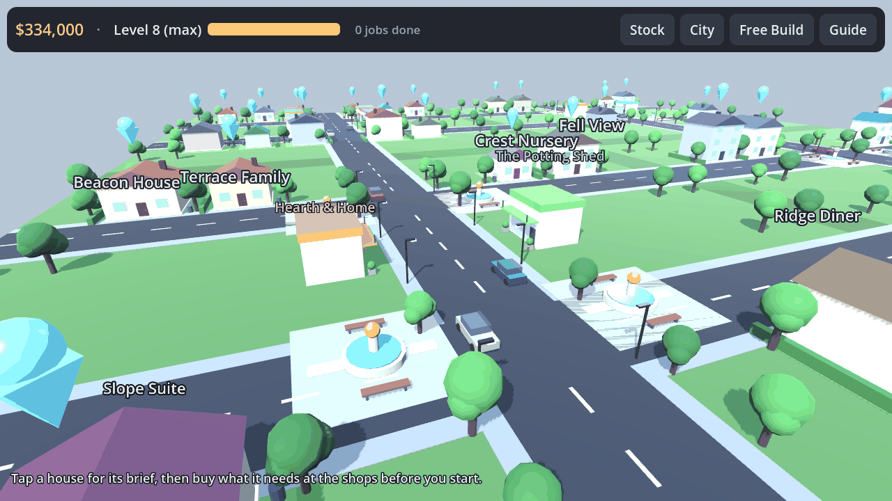

| Dock & Salvage before you own the wharf | Atelier Nine, once you do |
|---|---|
| 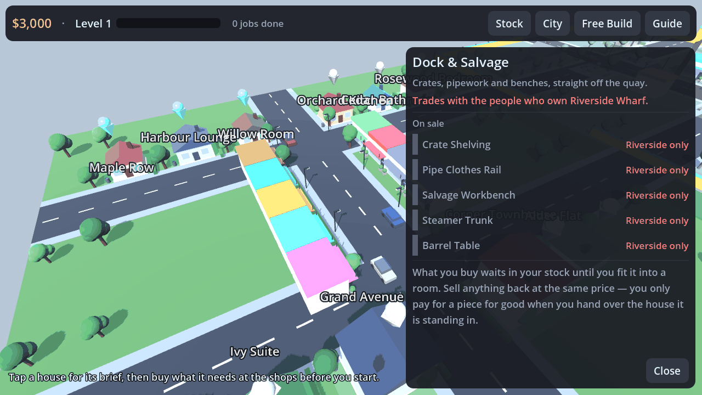 | 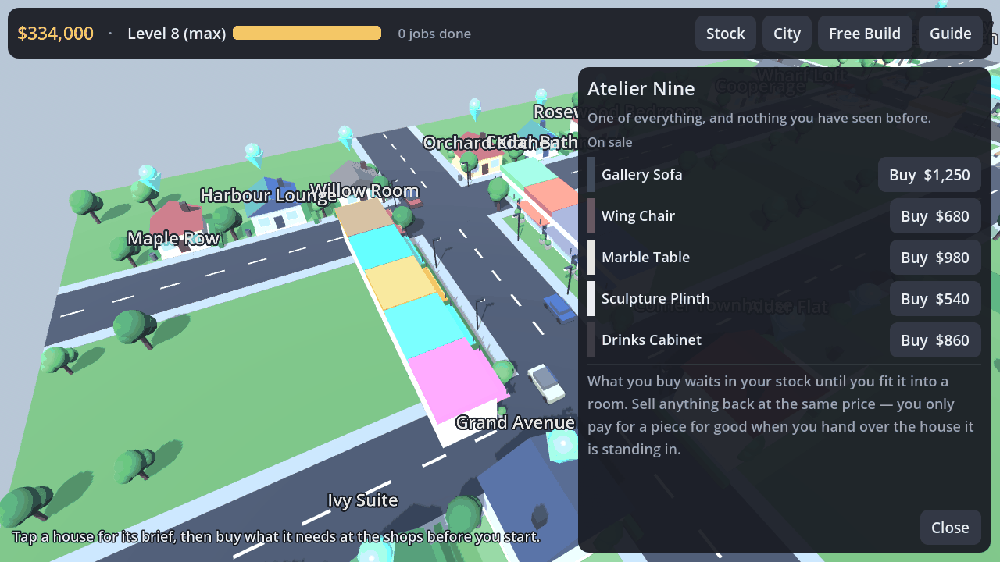 |

The electronics counter opens at level 2, and the pieces on it are the ones the later
briefs — media rooms, home offices — ask for.

Seventeen of these have tops you can put things on — every table and desk, the counters
and the kitchen island, the nightstand, dresser, low cabinet, TV stand, and the bookshelf
and display cabinet — and twelve small pieces ride on them: the table lamp, vase, stack of
books, potted plant, televisions, computer, soundbar, games console, printer, kettle,
toaster and microwave. Drag one over a top and it settles onto it; drag it off and it drops
back to the floor. A prop too tall to clear the ceiling from a given top stays on the floor
rather than sticking out through the wall.

| Volt & Wire | A media room fitted out of it |
|---|---|
| 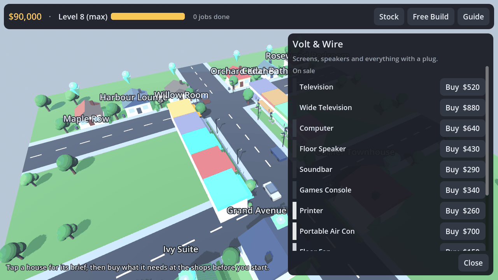 | 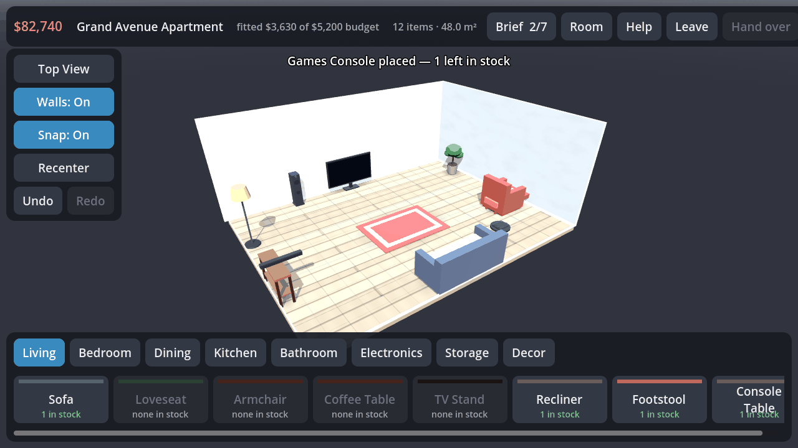 |

## How the project fits together

```
scenes/main.tscn         One node; everything else is built in code
scripts/
  game.gd                Swaps between the title screen, the city and the
                         designer, running each build a stage at a time behind
                         a loading screen
  title_screen.gd        The front page: menu, save summary, and a furnished
                         room turning behind it
  data/
    catalog.gd           Autoload. Every model and price, the twenty-six shops
                         with the quarter and level each one opens at, and the
                         bill of materials every piece is worked out to take
    perks.gd             Autoload. The four lines of the trade, their eight
                         steps each, and what a step is worth
    staff.gd             Autoload. The four people you can put on the books,
                         what each takes out of a fee and what they do for it
    showroom.gd          What a floor of your own takes an hour: the review, the
                         spread of counters and what is standing on it
    jobs.gd              Autoload. The six quarters and the 56 houses in them,
                         the requirement evaluator, the shopping list a brief
                         needs, and the generator for repeat contracts
    game_state.gd        Autoload. Money, XP, levels, the warehouse, the
                         quarters bought, the estate, the yard, the trade store,
                         the workshop bench, the perks taken, who is on the
                         books, the showroom and its till, and the saved
                         profile
    industry.gd          Autoload. The eight holdings, the four works and the
                         workshop: what everything yields, what it costs, and
                         which good a piece of furniture wants
    room_review.gd       The five things a client notices, scored out of three
    layout_store.gd      Free-build save files under user://
  audio/
    sound_bank.gd        Every sound in the game, synthesised from scratch:
                         blips, thuds, brushed noise, struck bells and the
                         four-chord bed
    audio.gd             Autoload. Builds the bank on a worker thread, fires
                         cues through a pool of six voices, and holds the two
                         switches
  shop/
    shop_floor.gd        The inside of a shop: fittings welded into a batch,
                         the stock standing on the floor as real pieces, the
                         tins for the Colour House and the pallets for the yard
    shop_ui.gd           The wallet, and the card for whatever was tapped
  city/
    city_view.gd         The six procedural quarters, their house archetypes,
                         planting, pins, hoardings and pick volumes
    city_life.gd         The layer that moves: traffic, people on the
                         pavements, blossom over Hanami and birds over Hollow,
                         all of it MultiMeshed
    scenery_batch.gd     Welds the whole city into three draw calls, and
                         builds the pitched roofs every map is made of
    city_ui.gd           Wallet, XP bar, briefing sheet, shop counters, stock,
                         and the quarter you are thinking about buying
  estate/
    estate_view.gd       The map out of town: the holdings and what grows or is
                         dug on them, the works and their chimneys, and the
                         workshop at the end of the road
    estate_ui.gd         The yard tally, and the sheet for whichever plot was
                         tapped
  design/
    designer.gd          The room: gestures, stock, wall snap, stacking,
                         overlap tests, hand-over. Runs a client's job, the
                         player's own showroom floor or the free-build sandbox
    design_history.gd    Undo and redo, by snapshot
    design_ui.gd         Tray, brief checklist, dialogs
  world/
    furniture_item.gd    A placed piece: one merged mesh, pick body, footprints
    item_icons.gd        Autoload. Renders a thumbnail of each catalogue piece
                         into an off-screen viewport, one per frame, and caches
                         it for the tray
    mesh_builder.gd      Welds a part list into one shared mesh per item type
    prim.gd              The shapes a piece is built from: chamfered boxes,
                         soft ones for upholstery, and tapered ones for legs
    proc_textures.gd     Floorboards, plaster and contact shadows, generated
    room.gd              The floor plan: floors, walls, skirting, doorways,
                         grid, wall auto-hide and a paint scheme per room
    camera_rig.gd        Damped orbit camera, shared by both screens
    selection_marker.gd  Floor highlight under the selection
  ui/ui_kit.gd           The theme and widget helpers both screens share
tests/smoke_test.gd      Plays the whole career headless, then checks the
                         catalogue, the placement aids, undo, the star review
                         and a generated contract
```

Furniture is data, not geometry files. A piece is a list of boxes, cylinders and spheres
with a material role each, plus what it costs and who sells it, so adding one means adding
a dictionary to `catalog.gd`:

```gdscript
_add({
    "id": "toilet", "name": "Toilet", "category": "Bathroom",
    "price": 280, "level": 1,
    "tint": Color(0.97, 0.97, 0.96),
    "parts": [
        {"shape": "box", "size": Vector3(0.40, 0.58, 0.20), "pos": Vector3(0, 0.34, -0.24), "mat": "tint"},
        ...
    ],
})
```

An entry can also name the `"shop"` that stocks it, which is what puts a piece behind a
quarter's gate; leave it out and the piece goes to whichever shop covers its category.

Parts marked `"mat": "tint"` follow the colour the player picks; the other roles
(`wood`, `metal`, `porcelain`, `glass`, …) are fixed. Footprints, heights and pick volumes
are all derived from the parts, so nothing needs measuring by hand. A few optional flags
change how a piece behaves: `"surface": 0.74` lets things be put on top of it,
`"stackable": true` marks a piece that belongs on a table, and `"against_wall": true` tells
the reviewer it should be at the edge of the room.

At load time each part list is welded into a single mesh with one surface per material and
shared between every copy in the room, so a piece costs one node rather than fifteen. The
city does the same trick with vertex colours and draws the entire neighbourhood — roads,
houses, shopfronts, trees, cars — in three calls.

A job is a dictionary too. Requirements are declarative and checked against the room as it
stands, so a new contract is a few lines:

```gdscript
{
    "id": "cedar_bathroom", "name": "Cedar Guest Bathroom", "client": "Zeynep",
    "district": "maple",
    "level": 2, "budget": 1550, "payout": 2150, "xp": 160,
    "room": {"w": 3.5, "d": 3.0, "h": 2.5},
    "requirements": [
        {"type": "item", "id": "toilet", "count": 1},
        {"type": "item", "id": "shower", "count": 1},
        {"type": "no_overlap"},
    ],
}
```

Supported requirement kinds: `item`, `category`, `total`, `categories` (distinct shops),
`floor_color`, `wall_color` and `no_overlap`.

A job with more than one room carries a `rooms` plan instead of a single rectangle, and its
`item`, `category` and `total` lines can name one of them:

```gdscript
"room": {"h": 3.0},
"rooms": [
    {"id": "living",  "name": "Living room", "w": 5.0, "d": 4.5, "x": -2.5, "z": 0.0},
    {"id": "bedroom", "name": "Bedroom",     "w": 3.6, "d": 4.5, "x":  1.8, "z": 0.0},
],
"requirements": [
    {"type": "item", "id": "sofa", "count": 1, "room": "living"},
    {"type": "item", "id": "bed_double", "count": 1, "room": "bedroom"},
],
```

The rectangles just have to butt up against each other. `room.gd` works out for itself
which runs of wall are the outside of the flat and which divide two rooms, and knocks a
doorway through every divider — so a new floor plan is a few lines of data, not geometry.

A quarter is a dictionary as well — a name, where it sits on the grid, what it costs and
the level it opens at. Every house puts its `map.pos` relative to its quarter's `origin`,
so a new quarter is one entry plus however many houses you want to drop into it:

```gdscript
{
    "id": "hanami", "name": "Hanami Ward",
    "origin": Vector2(-SPACING, 0), "cost": 68000, "level": 19,
    "accent": Color(0.90, 0.62, 0.70),
    "planting": "cherry", "ground": Color(0.38, 0.50, 0.34),
    "tagline": "Timber houses under the cherry trees …",
}
```

The city view builds each quarter from the same code, offset by its origin and drained
towards grey while it is still locked, so adding one costs no new geometry. `planting` and
`ground` change what the quarter is grown on and with; a house picks its shape with
`style.kind`, which is `machiya` and `manor` for the last two quarters and an ordinary
terrace house for everything else.

## Checking it still works

`tests/smoke_test.gd` is autoloaded but does nothing unless you ask for it:

```bash
godot --headless -- --smoke
```

It resets the profile and plays the whole city: all 40 jobs, quarter by quarter, buying
each quarter out of the money it has actually earned — taking repeat contracts at the
houses it has already finished when it is short of money or of levels — shopping for each
brief, fitting the room from stock and handing it over. Then it checks that every quarter is priced above the one
before and starts locked, that every shop stands in a real quarter and no brief asks for
stock the player could not have bought by then, that no client is asked for more furniture
than their budget covers, that no two rooms of a floor plan overlap and a bed in the wrong
room does not tick the right room's line, that paint laid in one room stays there and
survives a save and reload, that every catalogue entry is priced, stocked and
physically sane, that wall snap lands flush and stacking finds the right height, that undo and redo
keep the room and the warehouse in step, that a properly arranged room really does reach
three stars, that a generated repeat contract can be shopped for and finished, and that the
tray starts closed and can tell a drag along the row from a tap on a piece, that the perk
tree is bigger than a career can afford and none of its steps opens above the level cap,
that a step cannot be taken a level before it opens or without a point in hand, that
haggling comes off every price and off the refund with it so buying and selling is still a
wash, that a perk makes the ground yield faster without making the barn bigger, and that a
bench with room for two really does make two at once, that a wage comes out of a fee and
out of nothing else, that the runner buys the whole of a brief's list at the counters' own
prices and cannot shop on an empty account, and that each of the other three has already
done their chore by the time you look — the career itself is played with the points spent
four lines abreast and everybody on the books, so the whole city is balanced against
features nobody leaves switched off — that the showroom opens as neither a job nor the
sandbox, takes its furniture out of the warehouse and gives it back, comes with no starter
room of free furniture, and that a cheap floor arranged well really does out-earn an
expensive one thrown together, that its till fills on the clock, stops after a trading day
and pays out once, that every
piece in the catalogue is worth making and worth about as much to make as every other piece
is — material between a third and three quarters of the shelf price for all 167 of them —
and that trade material bought at the merchant goes into a piece when it is started rather
than when it is collected, comes off the bench only when its time is up, and queues one at a
time behind whatever is already on it, that the
app opens on the title screen with its buttons wired to the right places, that both
changes of screen are covered end to end by a loading screen whose bar runs from one end to
the other, that a brief lists every missing piece under the counter that sells it without
offering to buy any of it for you, that no piece is in the catalogue twice, that no house
opens before the stock its brief asks for does or before the quarter it stands in, and that
the career ends at the level cap without having reached it before the last quarter opened, and that every cue the game asks for by name is one the sound bank actually
builds, none of them clipping and none more than half again as loud as the quietest. It
reports everything that does not hold and exits non-zero.

## Building it yourself

The APK is built remotely by [`.github/workflows/android-release.yml`](.github/workflows/android-release.yml)
on every push and published as a GitHub Release asset. The workflow installs the Android
SDK build tools, downloads Godot and its export templates, exports a signed release APK,
verifies the signature, and attaches it to the release tagged `v<config/version>`.

Trigger it by hand from the Actions tab to publish under a different tag.

To build locally you need Godot 4.5.1, its export templates, and an Android SDK with
build-tools installed:

```bash
export ANDROID_HOME=/path/to/android-sdk
export GODOT_ANDROID_KEYSTORE_RELEASE_PATH="$PWD/signing/room-designer.keystore"
export GODOT_ANDROID_KEYSTORE_RELEASE_USER=roomdesigner
export GODOT_ANDROID_KEYSTORE_RELEASE_PASSWORD=roomdesigner

godot --headless --import
godot --headless --export-release "Android" build/room-designer-3d.apk
```

Using the project key means a build from your machine installs over one from CI and the
other way round.

Godot finds the SDK through the editor setting `export/android/android_sdk_path`, so set
that in the editor, or write `~/.config/godot/editor_settings-4.5.tres` the way the
workflow does.

### Signing

Android only installs a build over another one signed by the same certificate. So the key
cannot change between releases, and the repository carries one:

```
signing/room-designer.keystore     alias roomdesigner, password roomdesigner
signing/fingerprint.txt            the certificate that key produces
```

**That key is public and is not a secret.** It exists so that every build — from CI, from
your machine, from anyone's fork — installs as an update rather than making you uninstall
first. What it does not do is prove who built an APK: anyone with this repository can sign
one that Android will accept as an update to this app. That is an acceptable trade for a
hobby app you install by hand from a Releases page; it would not be for anything on Play.

The workflow checks the certificate it actually produced against `signing/fingerprint.txt`
and fails the build on a mismatch, because a silently-changed key is exactly the bug this
is here to prevent.

To sign with a key of your own instead, set these repository secrets — the workflow prefers
them over the project key, and skips the fingerprint check:

| Secret | Contents |
|---|---|
| `ANDROID_KEYSTORE_BASE64` | `base64 -w0 release.keystore` |
| `ANDROID_KEYSTORE_ALIAS` | The key alias |
| `ANDROID_KEYSTORE_PASSWORD` | The store and key password |

Be aware that switching costs one uninstall: the first build under a new key will not
install over a release signed with the old one.

### Changing the ABIs

`export_presets.cfg` ships `arm64-v8a` and `armeabi-v7a`, which covers physical devices.
Flip `architectures/x86_64=true` if you also want the APK to run in an emulator; it adds
roughly 25 MB.
