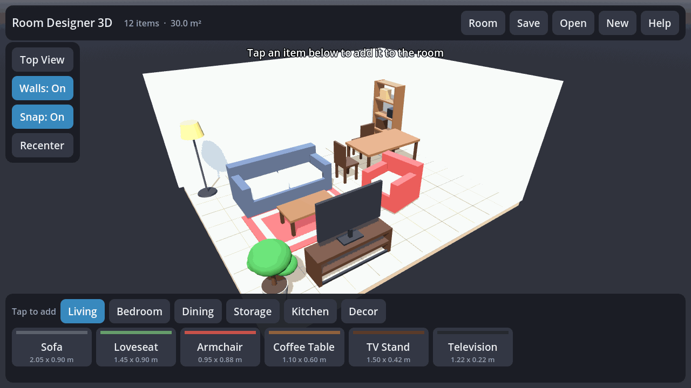
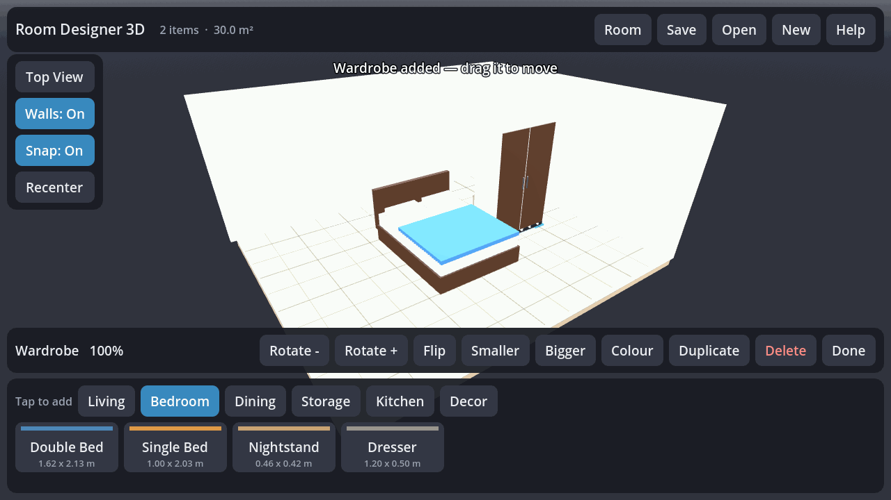

# Room Designer 3D

A touch-first 3D room planner for Android, built with [Godot](https://godotengine.org) 4.5.

Lay out a room on your phone or tablet: set the floor plan, drop in furniture, slide it
around with your finger, spin it, resize it, recolour it, and save the result. Everything
is drawn from primitives at runtime, so the whole app is a few text files and a 51 MB APK
with no downloaded assets.



| Plan view | Building a bedroom |
|---|---|
|  |  |

## Getting the app

Grab `room-designer-3d.apk` from the [latest release](../../releases/latest) and open it on
your device. Android asks you to allow installs from an unknown source the first time.

- **Minimum Android:** 7.0 (API 24)
- **ABIs:** `arm64-v8a`, `armeabi-v7a`
- **Permissions:** none — the app never touches the network or your files outside its own
  storage

## Using it

| Gesture | Result |
|---|---|
| Tap an item in the bottom tray | Adds it to the room and selects it |
| Tap a piece of furniture | Selects it |
| Drag a selected piece | Slides it along the floor, kept inside the walls |
| Drag empty space | Orbits the camera |
| Pinch | Zooms |
| Two-finger drag | Pans across the floor |
| Back button | Closes the dialog, then clears the selection, then exits |

The bar that appears under a selection rotates in 15° steps, flips 180°, scales between
50 % and 200 %, recolours, duplicates and deletes. **Top View** switches to a plan view and
drops the walls; **Walls** turns the shell off entirely; **Snap** toggles the 25 cm grid.

Walls between you and the room hide themselves as you orbit, so the interior is always
visible. A piece that overlaps another glows red — a hint, not a restriction.

The **Room** dialog sets the floor plan from 2 × 2 m up to 14 × 14 m, along with floor and
wall colours. Layouts are saved to the device under `user://layouts/`, and the arrangement
you leave behind is restored automatically next time you open the app.

### Catalogue

25 pieces across six categories:

| Category | Pieces |
|---|---|
| Living | Sofa, loveseat, armchair, coffee table, TV stand, television |
| Bedroom | Double bed, single bed, nightstand, dresser |
| Dining | Dining table, round table, chair, bar stool |
| Storage | Wardrobe, bookshelf, desk, low cabinet |
| Kitchen | Counter, refrigerator, stove, sink unit |
| Decor | Rug, floor lamp, potted plant, side table, partition |

## How the project fits together

```
project.godot            Project settings (mobile renderer, sensor landscape)
export_presets.cfg       Android export preset
scenes/main.tscn         One node; everything else is built in code
scripts/
  catalog.gd             Autoload. Every model, described as primitive parts
  furniture_item.gd      A placed piece: meshes, pick body, footprint maths
  room.gd                Floor, walls, skirting, grid; wall auto-hide
  camera_rig.gd          Damped orbit camera
  selection_marker.gd    Floor highlight under the selection
  layout_store.gd        JSON save/load under user://
  ui.gd                  The whole interface, built in code
  main.gd                Scene setup, gestures, selection, overlap tests
assets/                  App icon and Android launcher icons
```

Furniture is data, not geometry files. A piece is a list of boxes, cylinders and spheres
with a material role each, so adding one means adding a dictionary to `catalog.gd`:

```gdscript
_add({
    "id": "nightstand",
    "name": "Nightstand",
    "category": "Bedroom",
    "tint": Color(0.79, 0.64, 0.45),
    "parts": [
        {"shape": "box", "size": Vector3(0.46, 0.50, 0.40), "pos": Vector3(0, 0.33, 0), "mat": "tint"},
        ...
    ],
})
```

Parts marked `"mat": "tint"` follow the colour the user picks for that piece; the other
material roles (`wood`, `metal`, `glass`, …) are fixed. Footprints, heights and pick
volumes are all derived from the parts, so nothing needs to be measured by hand.

## Building it yourself

The APK is built remotely by [`.github/workflows/android-release.yml`](.github/workflows/android-release.yml)
on every push, and published as a GitHub Release asset. The workflow installs the Android
SDK build tools, downloads Godot and its export templates, exports a signed release APK,
verifies the signature, and attaches it to the release tagged `v<config/version>`.

Trigger it by hand from the Actions tab to publish under a different tag.

To build locally you need Godot 4.5.1, its export templates, and an Android SDK with
build-tools installed:

```bash
export ANDROID_HOME=/path/to/android-sdk
export GODOT_ANDROID_KEYSTORE_RELEASE_PATH=/path/to/release.keystore
export GODOT_ANDROID_KEYSTORE_RELEASE_USER=your-alias
export GODOT_ANDROID_KEYSTORE_RELEASE_PASSWORD=your-password

godot --headless --import
godot --headless --export-release "Android" build/room-designer-3d.apk
```

Godot finds the SDK through the editor setting `export/android/android_sdk_path`, so set
that in the editor, or write `~/.config/godot/editor_settings-4.5.tres` the way the
workflow does.

### Signing

If the repository has these secrets, the workflow signs with your own key:

| Secret | Contents |
|---|---|
| `ANDROID_KEYSTORE_BASE64` | `base64 -w0 release.keystore` |
| `ANDROID_KEYSTORE_ALIAS` | The key alias |
| `ANDROID_KEYSTORE_PASSWORD` | The store and key password |

Without them the workflow generates a throwaway key for that build. The APK still installs
fine, but each build is signed by a different key, so Android will refuse to install one
over another — uninstall the old copy first. Set the secrets if you plan to ship updates.

### Changing the ABIs

`export_presets.cfg` ships `arm64-v8a` and `armeabi-v7a`, which covers physical devices.
Flip `architectures/x86_64=true` if you also want the APK to run in an emulator; it adds
roughly 25 MB.
