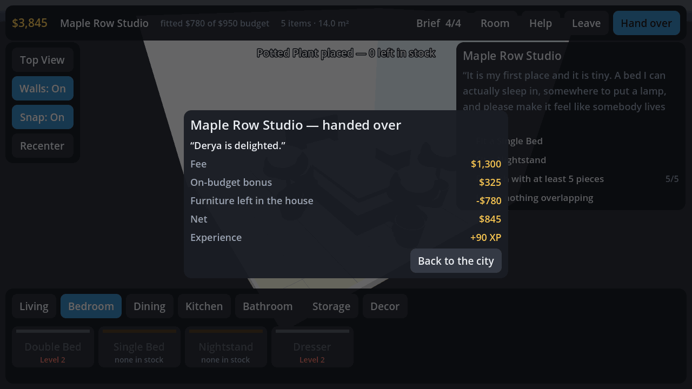

# Room Designer 3D

An Android interior-design game built with [Godot](https://godotengine.org) 4.5.

You start with $3,000 and a city full of clients. Pick a house off the map, read what the
owner wants, go and buy the furniture into your own stock, then fit the room out from that
stock until every line of the brief is ticked and hand it over for the fee. Finished jobs
pay experience, and levelling up opens the pricier shops, the better paints and the larger
houses. It is House Flipper's loop, shrunk to a phone screen.


| Reading a brief | Buying at a shop |
|---|---|
|  |  |

| Your stock | Fitting the room out |
|---|---|
|  |  |



## Getting the app

Grab `room-designer-3d.apk` from the [latest release](../../releases/latest) and open it on
your device. Android asks you to allow installs from an unknown source the first time.

- **Minimum Android:** 7.0 (API 24)
- **ABIs:** `arm64-v8a`, `armeabi-v7a`
- **Permissions:** none — the app never touches the network or your files outside its own
  storage

## Playing

### The city

Ten houses sit along two residential streets, with eight shops down the avenue between
them. A floating pin over each house tells you where it stands:

| Pin | Meaning |
|---|---|
| Blue | Available — tap for the brief |
| Amber | Started, furniture already bought |
| Green | Handed over |
| Grey | Locked until you reach the level shown |

Tapping a shop opens its counter: what it sells, what each piece costs, how many you
already own, and a **Buy** button. Anything you own can be sold straight back at the price
you paid. The Colour House works the same way, except a colour is bought once and is then
yours to use in every room forever.

**Stock** in the top bar is your warehouse: everything bought and not yet fitted, with the
money tied up in it.

### Money, stock and the room

Money only ever moves in the city. Inside a room you spend *stock*, never cash:

1. **Buy** furniture at a shop — it goes into your warehouse.
2. **Place** it in a client's room — it leaves the warehouse.
3. **Put it back** and it returns to the warehouse, ready for the next house.
4. **Hand the job over** and the pieces standing in that room stay with the client. That is
   the moment they are finally paid for.

Nothing is ever wasted: a piece is only spent for good when a client keeps it, and until
then you can always sell it back for what you paid. That also means you can never be
stranded with no money and no way out.

### A job

The briefing sheet gives you the client's words, the room size, the fee, their budget and
the experience on offer. Under the brief it lists exactly what you are still missing, and
the **Buy all** button next to *Start job* fills the whole basket in one tap — including any
paint the brief calls for.

Take the job and you land in the room with the brief checklist on the right; it re-ticks
itself live as you work. The tray shows how many of each piece you have left rather than a
price. Once every line is ticked, **Hand over** collects the fee, plus a bonus of a quarter
of the fee if the furniture you left behind came in under the client's budget.

| Gesture | Result |
|---|---|
| Tap an item in the tray | Takes one out of stock and drops it into the room |
| Tap a piece of furniture | Selects it |
| Drag a selected piece | Slides it along the floor, kept inside the walls |
| Drag empty space | Orbits the camera |
| Pinch | Zooms |
| Two-finger drag | Pans across the floor |
| Back button | Closes the dialog, then clears the selection, then leaves |

The bar under a selection rotates in 15° steps, flips 180°, scales between 50 % and 200 %,
recolours, duplicates and puts back. **Top View** switches to a plan view and drops the walls;
**Snap** toggles the 25 cm grid. Walls between you and the room hide themselves as you
orbit, and a piece that overlaps another glows red — most briefs ask for a clean room.

### Progress

Experience carries you from level 1 to level 8. Jobs run from a $1,300 studio to a
$10,500 townhouse, and a run that buys only what each brief asks for finishes all ten with
around $33,000 in the bank at level 6. Everything — money, level, stock, paints, finished
jobs and the rooms you left half-done — is saved to the device as you go.

**Free Build** on the map opens the old sandbox: no client, no stock to worry about,
everything unlocked, with its own save and load.


## The catalogue

32 pieces across seven shops, all built from primitives at runtime:

| Shop | Opens | Stock |
|---|---|---|
| Sofa & Co | 1 | Sofa, loveseat, armchair, coffee table, TV stand, television |
| Dream Beds | 1 | Double bed, single bed, nightstand, dresser |
| Table Talk | 1 | Dining table, round table, chair, bar stool |
| Box & Shelf | 1 | Wardrobe, bookshelf, desk, low cabinet |
| Little Details | 1 | Rug, floor lamp, potted plant, side table, partition |
| Kitchen Works | 2 | Counter, refrigerator, stove, sink unit |
| Splash & Tile | 2 | Toilet, basin, bathtub, shower, washing machine, vanity unit, towel rail |
| Colour House | 1 | Eight floor paints and eight wall paints, $160–$540 each |

## How the project fits together

```
scenes/main.tscn         One node; everything else is built in code
scripts/
  game.gd                Swaps between the city and the designer
  data/
    catalog.gd           Autoload. Every model, price, shop and unlock level
    jobs.gd              Autoload. The ten houses, the requirement evaluator and
                         the shopping list a brief still needs
    game_state.gd        Autoload. Money, XP, levels, the warehouse and the
                         saved profile
    layout_store.gd      Free-build save files under user://
  city/
    city_view.gd         The procedural neighbourhood, its pins and pick volumes
    city_ui.gd           Wallet, XP bar, briefing sheet, shop counters, stock
  design/
    designer.gd          The room: gestures, stock, overlap tests, hand-over
    design_ui.gd         Tray, brief checklist, dialogs
  world/
    furniture_item.gd    A placed piece: meshes, pick body, footprint maths
    room.gd              Floor, walls, skirting, grid; wall auto-hide
    camera_rig.gd        Damped orbit camera, shared by both screens
    selection_marker.gd  Floor highlight under the selection
  ui/ui_kit.gd           The theme and widget helpers both screens share
```

Furniture is data, not geometry files. A piece is a list of boxes, cylinders and spheres
with a material role each, plus what it costs and who sells it, so adding one means adding
a dictionary to `catalog.gd`:

```gdscript
_add({
    "id": "toilet", "name": "Toilet", "category": "Bathroom",
    "price": 280, "level": 1,
    "tint": Color(0.97, 0.97, 0.96),
    "parts": [
        {"shape": "box", "size": Vector3(0.40, 0.58, 0.20), "pos": Vector3(0, 0.34, -0.24), "mat": "tint"},
        ...
    ],
})
```

Parts marked `"mat": "tint"` follow the colour the player picks; the other roles
(`wood`, `metal`, `porcelain`, `glass`, …) are fixed. Footprints, heights and pick volumes
are all derived from the parts, so nothing needs measuring by hand.

A job is a dictionary too. Requirements are declarative and checked against the room as it
stands, so a new contract is a few lines:

```gdscript
{
    "id": "cedar_bathroom", "name": "Cedar Guest Bathroom", "client": "Zeynep",
    "level": 2, "budget": 1550, "payout": 2150, "xp": 160,
    "room": {"w": 3.5, "d": 3.0, "h": 2.5},
    "requirements": [
        {"type": "item", "id": "toilet", "count": 1},
        {"type": "item", "id": "shower", "count": 1},
        {"type": "no_overlap"},
    ],
}
```

Supported requirement kinds: `item`, `category`, `total`, `categories` (distinct shops),
`floor_color`, `wall_color` and `no_overlap`.

## Building it yourself

The APK is built remotely by [`.github/workflows/android-release.yml`](.github/workflows/android-release.yml)
on every push and published as a GitHub Release asset. The workflow installs the Android
SDK build tools, downloads Godot and its export templates, exports a signed release APK,
verifies the signature, and attaches it to the release tagged `v<config/version>`.

Trigger it by hand from the Actions tab to publish under a different tag.

To build locally you need Godot 4.5.1, its export templates, and an Android SDK with
build-tools installed:

```bash
export ANDROID_HOME=/path/to/android-sdk
export GODOT_ANDROID_KEYSTORE_RELEASE_PATH=/path/to/release.keystore
export GODOT_ANDROID_KEYSTORE_RELEASE_USER=your-alias
export GODOT_ANDROID_KEYSTORE_RELEASE_PASSWORD=your-password

godot --headless --import
godot --headless --export-release "Android" build/room-designer-3d.apk
```

Godot finds the SDK through the editor setting `export/android/android_sdk_path`, so set
that in the editor, or write `~/.config/godot/editor_settings-4.5.tres` the way the
workflow does.

### Signing

If the repository has these secrets, the workflow signs with your own key:

| Secret | Contents |
|---|---|
| `ANDROID_KEYSTORE_BASE64` | `base64 -w0 release.keystore` |
| `ANDROID_KEYSTORE_ALIAS` | The key alias |
| `ANDROID_KEYSTORE_PASSWORD` | The store and key password |

Without them the workflow generates a throwaway key for that build. The APK still installs
fine, but each build is signed by a different key, so Android will refuse to install one
over another — uninstall the old copy first. Set the secrets if you plan to ship updates.

### Changing the ABIs

`export_presets.cfg` ships `arm64-v8a` and `armeabi-v7a`, which covers physical devices.
Flip `architectures/x86_64=true` if you also want the APK to run in an emulator; it adds
roughly 25 MB.
